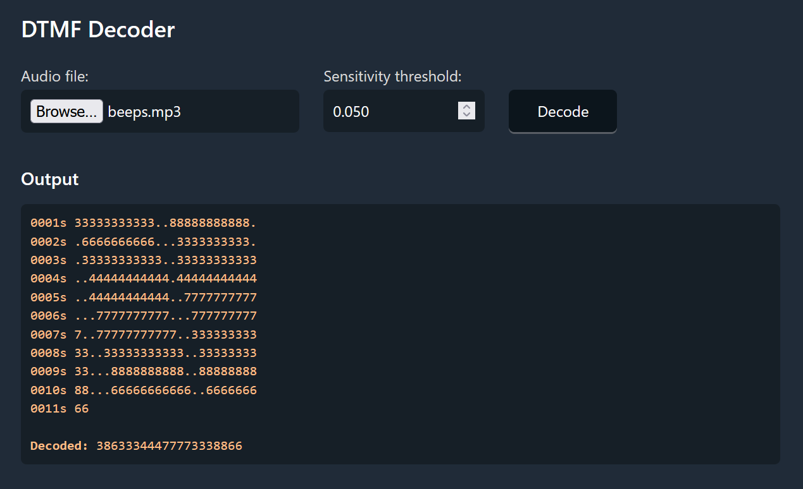
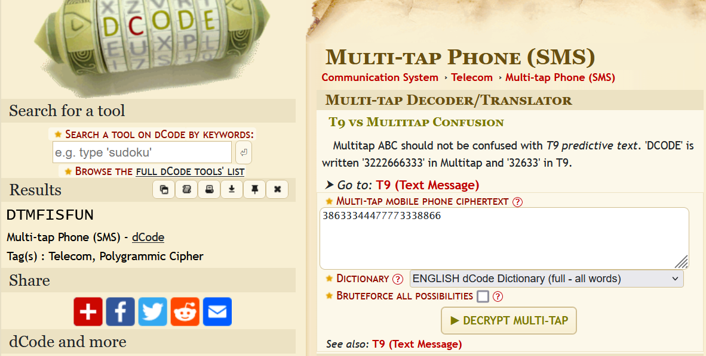

Beep, week 10 2025

'I got this weird message, can you figure out what it means?

Flag format: No format'

After listening to the given audio file, I could quickly tell that this was DTMF based on the beeping noises and its pitches. 
I put the audio file into a online DTMF decoder:

Using the decoded numbers, I put the numbers into a Multi-Tap SMS Decoder, which gives us our flag:

Flag is: 'DTMFISFUN'
