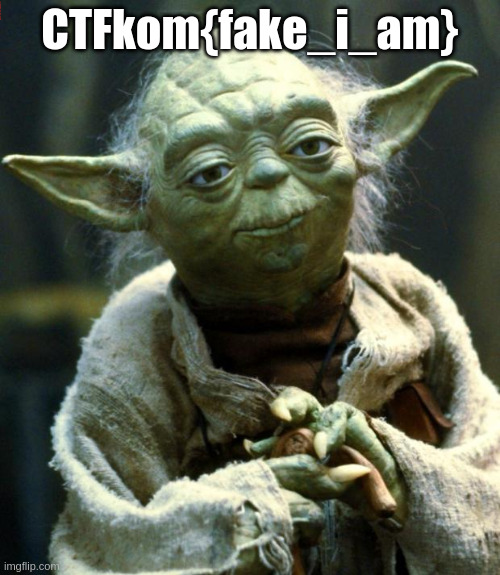
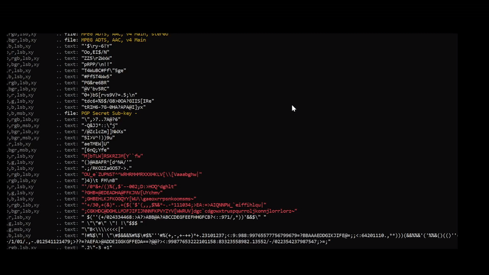
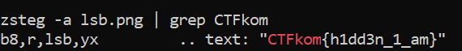

`There is a message hidden somewhere in this picture. I hid it pretty well in the LSB and ASCII values, but it isn't very secure.`

`Flag format: CTFkom{}`

Interesting. Right off the bat, since we are talking about steganography, the LSB and ASCII values probably have something to do with the file itself that we are given. In this case it's probably the least-significant bits of the pixels spell out text. In order to extract this text we can use a range of different steganography tools in our Linux terminal. I'm going with zsteg, which I find easy to use.

I am using the command `zsteg -a lsb.png`. This command tries out every method on our PNG file in order to find anything noteworthy. After running the code, we are met with many, many lines of gibberish. However, after a little scrolling, we find a funny looking flag that relates to our yoda picture.

`CTFkom{h1dd3n_1_am}`

Another method you can use with fewer lines is the command `zsteg -a lsb.png | grep CTFkom`, which simply pipelines the zsteg command and searches specifically for the string "CTFkom", which is in every Login CTF flag. 

