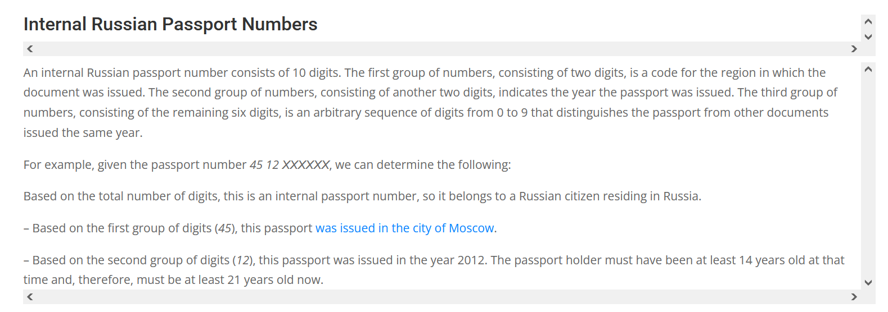
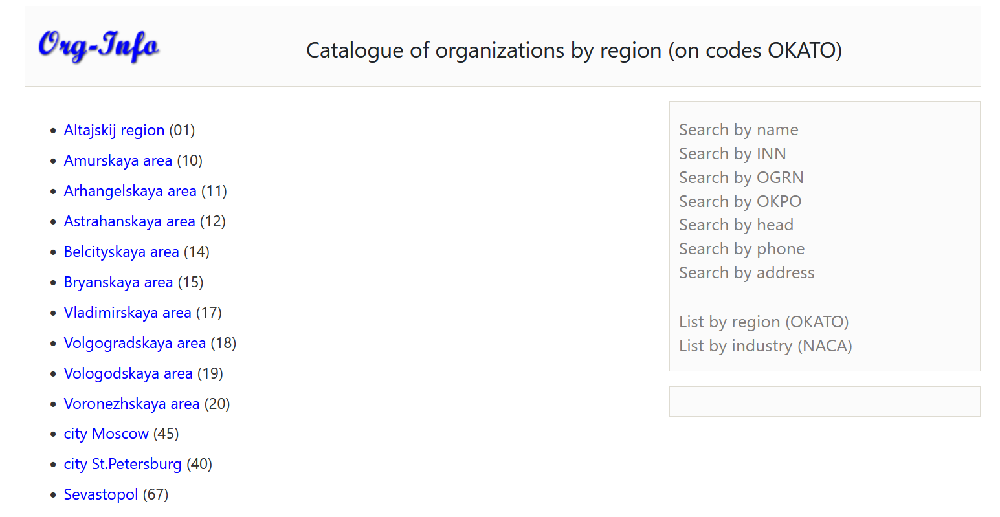
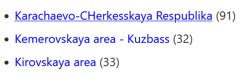

`You were sitting in your detective agency, going through the usual routine, when the phone rang. 
On the other end, an anonymous caller had a request—they wanted to send "a little gift" to a friend. 
Must be their birthday soon!`

`However, there was a catch. They didn’t know which city their friend lived in. 
The only information they provided was a name:`

`Artem Olegovich`

`Something about the call felt off. Sensing your hesitation, the caller insisted they were really good friends 
with Artem and, to prove it, sent over a scan of his passport. 
But the scan was terrible—blurred, distorted, and barely readable. 
The only thing you could make out? The first four digits of the passport number.`

`3215`

`Flag format: CTFkom{Trondheim}`

This challenge was understandably much trickier than the previous. We are met the name of a person, `Artem Olegovich`,
which seems to be Russian. We are also given the numbers `3215`, which apperantly are the first four digits of his
passport number.

Right off the bat, I looked the name up on Google, only to be met with virtually nothing useful. However, the numbers
we were given are definitely useful. After digging for a while looking at russian passports, I ended up finding a useful article on how one can use Russian passports in investigations: 
https://learn.sayari.com/using-russian-passport-numbers-in-investigations/

On this page, there is information on how you can identify where the passport was registered based on the passport number's
first two digits:

So a passport number starting with 45, would be registered in Moscow. By clicking the given link in this info tab, we are
met with a registry containing all the Russian OKATO codes. 

By looking at this list, we can see that the 
`Kremerovskaya area - Kuzbass` region uses the code 32. 

Narrowing it down to a specific city isn't that easy, 
as all of the administrative regions listed on this page only contains 8-digit numbers, all starting with 322- and up. 
Our number is 3215, which does not match with any of them. However, only the first 2 digits of the passport number
actually corresponds to a given region in Russia.
Only knowing which region we need to look, I looked up the biggest cities in the Kemerovo Oblast. The biggest one is
apperantly called Novokuznetsk. And boom, that turned out to be the flag.

`CTFkom{Novokuznetsk}`

